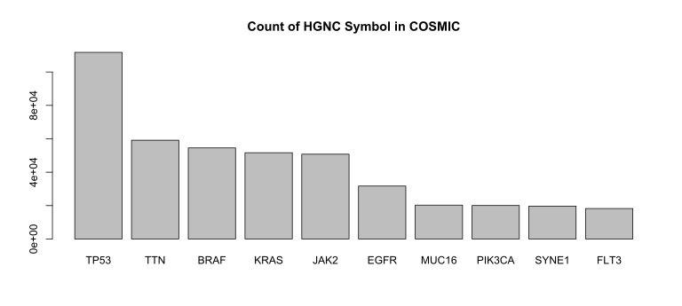
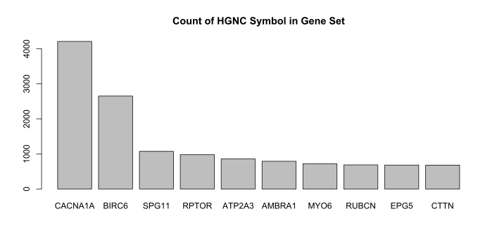

# BCB420.2019.COSMIC

#### (COSMIC data annotation of human genes)

###### Edward Ho &lt;emc.ho@mail.utoronto.ca&gt;

----

****

----

## 1 About this package:

This package describes the pipeline to download cancer somatic mutation from the [COSMIC database](https://cancer.sanger.ac.uk/cosmic), how to ensure the mutation entries have a proper HGNC symbol (where applicable), and calculation of basic statistics. This package will also provide an annotation of the example gene set (provided [here](https://github.com/hyginn/BCB420-2019-resources/blob/master/exampleGeneSet.md)), which is based on the phagosome/lysosome fusion system as reviewed by [(Corona & Jackson, 2018)](<https://doi.org/10.1016/j.tcb.2018.07.001>).


#### In this project ...

```text
--BCB420.2019.COSMIC/
   |__.gitignore
   |__.Rbuildignore
   |__.Rhistory
   |__BCB420.2019.COSMIC.Rproj
   |__DESCRIPTION
   |__dev/
      |__rptTwee.R
      |__toBrowser.R
   |__inst/
      |__extdata/
         |__xSetCosmic.tsv     # Annotated data of example gene set
      |__img/
         |__cosmicCount.svg    # Figure images
         |__cosmicSites.svg
         |__exampleCount.svg
         |__exampleSites.svg
      |__import.R
      |__scripts/
   |__LICENSE
   |__man/
   |__NAMESPACE
   |__R/
      |__zzz.R
   |__README.md
```

&nbsp;

----

## 2 COSMIC Data

COSMIC (Catalogue Of Somatic Mutations in Cancer) is an expert-curated collection of data describing somatic gene mutations found in human cancer. It presents phenotypic data (primary site and histology) associated with the gene mutations that is collected from the literature by experts from the literature, and also utilizes data from the Cancer Gene Census.

All COSMIC data is free for academic users, and requires an email address from an academic institution to register and download data. More information can be found [here](https://cancer.sanger.ac.uk/cosmic/license+&cd=1&hl=en&ct=clnk&gl=ca).


&nbsp;https://academic.oup.com/nar/article/47/D1/D941/5146192

#### 2.1 Data semantics


&nbsp;

## 3 Data download and cleanup

To download the source data from COSMIC ... :

1. Register on the [**COSMIC** website](
    https://cancer.sanger.ac.uk/cosmic/register), log in and navigate to to the [download section](https://cancer.sanger.ac.uk/cosmic/download).
2. Download the COSMIC Mutation Data (`CosmicMutantExport.tsv.gz`).
3. Uncompress the file and place it in <code>../data</code> (sister directory of working directory). <code>CosmicMutantExport.tsv</code> is **1.7 Gb**.

Additionally, we require data from the HGNC (HUGO Gene Nomenclature Committee) to map the HGNC IDs provided by COSMIC to the approved symbol, and also to validate that gene names are valid symbols.

1. Navigate to https://www.genenames.org/download/custom/
2. Keep the default settings and click Submit.
3. Save the text file as <code>hgnc.tsv</code> in the same <code>../data</code> directory as above.

&nbsp;

## 4 Mapping to HGNC symbols

COSMIC data includes the gene name for each observed mutation sample, and this name should be the associated HGNC symbol in most cases. Additionally, the tabulated data has a column for the HGNC ID, allowing the exact symbol to be found in the HGNC database. To ensure that the symbols are accurate, a map of the HGNC ID to the associated will be constructed for the unique HGNC IDs in the COSMIC database.

Some entries have multiple HGNC associated with them. For now, the HGNC symbol that corresponds with the entry's gene name will be used.

Furthermore, there are some cases where there is no HGNC ID, so the provided gene name will be used after validating that it is a valid HGNC symbol. Lastly, there are some gene names that are provided in other formats, such as Ensembl gene ID. These will be mapped (where possible) to the HGNC symbol using the biomaRt package.

&nbsp;

#### Preparations: packages, functions, files

**Required packages:**

**`readr`** to quickly read in the .tsv files provided by COSMIC.

```R
if (! requireNamespace("readr")) {
  install.packages("readr")
}
```


**`data.table`** to make subsetting tables by key [fast](https://cran.r-project.org/web/packages/data.table/vignettes/datatable). This is important as the COSMIC data is quite large (6,581,004 rows).

```R
if (! requireNamespace("data.table")) {
  install.packages("data.table")
}
```


**`biomaRt`** biomaRt is a Bioconductor package that implements the RESTful API of biomart,
the annotation framwork for model organism genomes at the EBI. It is a Bioconductor package, and as such it needs to be loaded via the **`BiocManager`**,

```R
if (! requireNamespace("BiocManager", quietly = TRUE)) {
  install.packages("BiocManager")
}
if (! requireNamespace("biomaRt", quietly = TRUE)) {
  BiocManager::install("biomaRt")
}
```

&nbsp;

#### 4.1 Loading the data into R

```R
# Load the HGNC data
hgnc <- readr::read_tsv(file.path("../data", "HGNC_data_all.tsv"), col_names=TRUE)

# Load the COSMIC data with defined columned types:
col_spec <- cols(
  `Gene name` = col_character(),
  `Accession Number` = col_character(),
  `Gene CDS length` = col_integer(),
  `HGNC ID` = col_character(), # This requires col_character because the "/" is used
  `Sample name` = col_character(),
  ID_sample = col_integer(),
  ID_tumour = col_integer(),
  `Primary site` = col_character(),
  `Site subtype 1` = col_character(),
  `Site subtype 2` = col_character(),
  `Site subtype 3` = col_character(),
  `Primary histology` = col_character(),
  `Histology subtype 1` = col_character(),
  `Histology subtype 2` = col_character(),
  `Histology subtype 3` = col_character(),
  `Genome-wide screen` = col_character(),
  `Mutation ID` = col_character(),
  `Mutation CDS` = col_character(),
  `Mutation AA` = col_character(),
  `Mutation Description` = col_character(),
  `Mutation zygosity` = col_character(),
  LOH = col_character(),
  GRCh = col_integer(),
  `Mutation genome position` = col_character(),
  `Mutation strand` = col_character(),
  SNP = col_character(),
  `Resistance Mutation` = col_character(),
  `FATHMM prediction` = col_character(),
  `FATHMM score` = col_double(),
  `Mutation somatic status` = col_character(),
  Pubmed_PMID = col_integer(),
  ID_STUDY = col_integer(),
  `Sample Type` = col_character(),
  `Tumour origin` = col_character(),
  Age = col_double() # Needed to use col_double as certain entries had decimal values
)

# Load data
cosmicData <- readr::read_tsv(file.path("../data", "CosmicMutantExport.tsv"), col_names = TRUE, col_types = col_spec)

# Data preview
head(cosmicData)
# A tibble: 6 x 36
#  `Gene name` `Accession Numb~ `Gene CDS lengt~ `HGNC ID` `Sample name` ID_sample ID_tumour `Primary site`
#  <chr>       <chr>                       <int> <chr>     <chr>             <int>     <int> <chr>         
#1 GRK6        ENST00000355472              1731 4545      PD1403a          898155    815769 stomach       
#2 TMEM108     ENST00000321871              1728 28451     TCGA-13-0760~   1474815   #1398514 ovary         
#3 HRH1        ENST00000397056              1464 5182      TCGA-13-0900~   1474861   #1398560 ovary         
#4 SLC26A8     ENST00000355574              2913 14468     TCGA-13-1509~   1474839   #1398538 ovary         
#5 OR51E1      ENST00000396952               957 15194     GC1_T           1645677   #1560711 stomach       
#6 CMYA5       ENST00000238522             11259 NA        TCGA-AG-3892~   1651564   #1566351 large_intesti~
# ... with 28 more variables: `Site subtype 1` <chr>, `Site subtype 2` <chr>, `Site subtype 3` <chr>,
```

&nbsp;

#### 4.2  Mapping the HGNC ID to HGNC symbol

Many of the entries in the COSMIC database already have an HGNC ID associated with it. In this case, we use this value and look up the corresponding symbol in the imported HGNC data.

###### 4.2.1 Cleaning the ID entries


As noted earlier, sometimes the mutation corresponds to two genes. In this case, we will use the first ID, which usually corresponds with the given gene name. Additionally, we add the HGNC prefix ("HGNC:") to the IDs so that they match the imported data.

```R
uHGNCID <- unique(cosmicData$`HGNC ID`)

# Take the first ID if a / is found
uHGNCID <- sapply(strsplit(uHGNCID, "/"), head, 1)
uHGNCID <- unique(cosmicData$`HGNC ID`)
uHGNCIDPrefix <- paste("HGNC:", uHGNCID, sep="") 

```


###### 4.2.2 Mapping the ID to the symbol

Using the unique HGNC IDs found in the COSMIC data, we create a data.table (<code>id2sym</code>) with the ID and the approved symbol using the <code>hgnc</code> table imported earlier. The data.table will use the HGNC ID as a key, and this allows for fast lookup through [binary search](https://cran.r-project.org/web/packages/data.table/vignettes/datatable-keys-fast-subset.html). Then, using this data.table, a new column <code>HGNCsym</code> is added to the <code>cosmicData</code> table which stores the approved symbol. 

```R
# Create id2sym that maps HGNC ID to HGNC Symbol
# Use data.table in order to utilize key search to speed up computation
index <- match(uHGNCIDPrefix, hgnc$`HGNC ID`)
id2sym <- data.table::data.table(`HGNC ID` = uHGNCID, `Gene name` = hgnc$`Approved symbol`[index])
data.table::setkey(id2sym, `HGNC ID`)

# Use id2sym to map the ID to the symbol
# allow.cartesian=TRUE to allow for duplicate IDs
cosmicData$HGNCsym <- id2sym[cosmicData$`HGNC ID`, allow.cartesian=TRUE]$`Gene name`

# See what our current coverage is for symbol mapping
sum(!is.na(cosmicData$HGNCsym)) / length(cosmicData$HGNCsym) # 0.8840686
```

So currently 88% of the dataset has an associated HGNC symbol. Not bad, but let's see if we can improve that. A quick observation was that some entries which had <code>NA</code> for its HGNC ID had gene names that resembled HGNC approved symbols. 

```R
head(cosmicData$`Gene name`[is.na(cosmicData$`HGNC ID`)])
#[1] "CMYA5"                    "CMYA5"                    "RNFT1_ENST00000305783"   
#[4] "C12orf41_ENST00000420613" "TFE3_ENST00000336239"     "TIAM1_ENST00000286827"   
# CMYA5 is a HGNC symbol, as is TFE3
```


#### 4.3 Using the gene name as the symbol where appropriate

To do this, first we collect the gene names of the entries with missing symbols (<code>missingNames</code>). From above, we can see that some gene names are HGNC symbols, and some of them also have an Ensemble transcript ID attached to it. We first strip the transcript IDs, and then check to see if the name matches the symbols in the HGNC data we imported. Then, we use the indices of the matches to add onto the <code>HGNCsym</code> column of the COSMIC data.

```R

# Now, need to deal with the entries with HGNC ID = NA
# Check if the provided gene name is found in the HGNC symbol list
missingNames <- cosmicData$`Gene name`[is.na(cosmicData$HGNCsym)]

# Let's also get rid of the _ENSTs
missingNames <- sapply(strsplit(missingNames, "_ENST"), head, 1)
hgncIndex <- match(missingNames, hgnc$`Approved symbol`)

# Add matches to the symbol column
cosmicData$HGNCsym[is.na(cosmicData$HGNCsym)] <- hgnc$`Approved symbol`[hgncIndex]

# Check updated coverage
sum(!is.na(cosmicData$HGNCsym)) / length(cosmicData$HGNCsym) # 0.9821093
sum(is.na(cosmicData$HGNCsym)) # 117739

# What do the missing genes look like?
head(cosmicData$`Gene name`[is.na(cosmicData$HGNCsym)])

#[1] "C12orf41_ENST00000420613" "AC093393.1"               "PCNXL3_ENST00000355703"  
#[4] "ENSG00000167390"          "LOC652153"                "LRRC16A"     
```
&nbsp;

#### 4.4 Using biomaRt to map Ensembl gene IDs to HGNC symbols

```R
# Update names with missing symbols (could not directly use name as symbol)
missingNames <- missingNames[is.na(hgncIndex)]

# Let's see if we can find any using the Ensembl gene ID
ensgIndex <- grepl("ENSG", missingNames)
ensembl <- missingNames[ensgIndex]

# Make a biomaRt and filter for the Ensemble gene ID
myMart <- biomaRt::useMart("ensembl", dataset="hsapiens_gene_ensembl")
ensemblMap <- biomaRt::getBM(filters="ensembl_gene_id", attributes = c("ensembl_gene_id", "hgnc_symbol"), values = unique(ensembl), mart=myMart)

# Use a data.table for fast lookup using keys
ensemblMap <- data.table::as.data.table(ensemblMap)
data.table::setkey(ensemblMap, "ensembl_gene_id")

# Remove empty matches
ensemblMap <- ensemblMap[hgnc_symbol != ""]

# Verify that the returned symbols are HGNC approved symbols
sum(!(ensemblMap$hgnc_symbol %in% hgnc$`Approved symbol`)) # 0

```


#### 4.5 Final validation

```R
# Check current coverage
sum(!is.na(cosmicData$HGNCsym)) / length(cosmicData$HGNCsym) # 0.9830611
sum(is.na(cosmicData$HGNCsym)) # 111475 - 6264 less than before

# How many unique HGNC symbols were found?
length(unique(cosmicData$HGNCsym)) # 19,033, but 19,032 after we account for NA values

# Are all these symbols approved symbols in the HGNC data?
sum(unique(cosmicData$HGNCsym) %in% hgnc$`Approved symbol`) # 19,032
```

So there are 111,475 COSMIC mutation entries that could not be mapped to a HGNC symbol. This may be because

1. The mutation occurred at a contig (set of overlapping DNA segments), so it could not be easily mapped to a single gene.
2. The mutation occurred somewhere in the DNA that has not been well characterized (no known function, etc).
3. The gene name given is a previous name or synonym. In this case, it is possible to go through the HGNC data and search the previous name/synonym columns, but the current implementation of this (presented below) is too slow:

```R
foundNames = vector(mode="integer", length=length(missingNames))
i <- 0
for (name in missingNames) {
  i <- i+1
  print(i)
  index <- grep(paste(name, "($|,)", sep=""), hgnc$`Previous symbols`)
  if (length(index) >= 1) {
    foundNames[which(name == missingNames)] <- index[1] # Just take the first match for now
  }
  else {
    index <- grep(paste(name, "($|,)", sep=""), hgnc$`Synonyms`)
    if (length(index) == 1) {
      foundNames[which(name == missingNames)] <- index
    }
  }
}
```


Finally, we save the COSMIC data. Since there is no unique identifier for each entry (even the mutation ID is not unique), we will save <code>cosmicData</code> into an RData file for future use. The resulting file is around 400 MB, which is a pretty good compression from the original 1.7 GB.

```R
save(cosmicData, file=file.path("inst", "extdata", "cosmicData.RData"))
```


## 5 Statistics

Let's look at which genes show up most often, and where the primary affected site of the cancer is in the COSMIC data.

```R
# Get the number of times each gene symbol appears in geneSetData
counts <- table(cosmicData$HGNCsym)
counts <- sort(counts, decreasing=TRUE)
barplot(counts[1:10], main="Count of HGNC Symbol in COSMIC")
```




This makes sense, as TP53 (tumor suppressor protein 53) is an important [tumor suppressor protein](https://ghr.nlm.nih.gov/gene/TP53). TTN, while not usually associated with tumors, encodes a very large protein (>30,000 amino acids), which makes it susceptibly to random DNA repair error, leading to residue alteration [(Tan, Bao, & Zhou, 2015)](https://doi.org/10.1038%2Fsrep12566).


## 6 Annotation of Example Data Set

Using the data imported and validated above, we will annotate the example gene set to be used in BCB420 (provided [here](https://github.com/hyginn/BCB420-2019-resources/blob/master/exampleGeneSet.md)). This is based on the phagosome/lysosome fusion system as reviewed by [Corona & Jackson (2018)](https://www.sciencedirect.com/science/article/pii/S0962892418301223).

```R
# Copy and pasted from BCB420.2019 resources
genes <- c("AMBRA1", "ATG14", "ATP2A1", "ATP2A2", "ATP2A3", "BECN1", "BECN2",
          "BIRC6", "BLOC1S1", "BLOC1S2", "BORCS5", "BORCS6", "BORCS7",
          "BORCS8", "CACNA1A", "CALCOCO2", "CTTN", "DCTN1", "EPG5", "GABARAP",
          "GABARAPL1", "GABARAPL2", "HDAC6", "HSPB8", "INPP5E", "IRGM",
          "KXD1", "LAMP1", "LAMP2", "LAMP3", "LAMP5", "MAP1LC3A", "MAP1LC3B",
          "MAP1LC3C", "MGRN1", "MYO1C", "MYO6", "NAPA", "NSF", "OPTN",
          "OSBPL1A", "PI4K2A", "PIK3C3", "PLEKHM1", "PSEN1", "RAB20", "RAB21",
          "RAB29", "RAB34", "RAB39A", "RAB7A", "RAB7B", "RPTOR", "RUBCN",
          "RUBCNL", "SNAP29", "SNAP47", "SNAPIN", "SPG11", "STX17", "STX6",
          "SYT7", "TARDBP", "TFEB", "TGM2", "TIFA", "TMEM175", "TOM1",
          "TPCN1", "TPCN2", "TPPP", "TXNIP", "UVRAG", "VAMP3", "VAMP7",
          "VAMP8", "VAPA", "VPS11", "VPS16", "VPS18", "VPS33A", "VPS39",
          "VPS41", "VTI1B", "YKT6")

# See which genes are not in COSMIC
notInCosmic <- genes[!(genes %in% cosmicData$HGNCsym)]
hgnc$`Approved name`[match(notInCosmic, hgnc$`Approved symbol`)]

# [1] "beclin 2"                                       
# [2] "RAB7B, member RAS oncogene family"              
# [3] "VPS11 core subunit of CORVET and HOPS complexes"

# Get the COSMIC data for all the genes in the example set
geneSetData <- cosmicData[cosmicData$HGNCsym %in% genes,]

# Can read in the exported data like so:
geneSetData <- readr::read_tsv(system.file("extdata", "xSetCosmic.tsv"), col_names=TRUE)
geneSetData <- readr::read_tsv(file.path("inst","extdata", "xSetCosmic.tsv"), col_names=TRUE)

```

Look at which genes showed up most often:

```R
# Get the number of times each gene symbol appears in geneSetData
counts <- table(geneSetData$HGNCsym)
counts <- sort(counts, decreasing=TRUE)
barplot(counts[1:10])
```



We repeat this for the primary sites in the example gene sets:

```R
# Get the number of times each gene symbol appears in geneSetData
counts <- table(geneSetData$HGNCsym)
counts <- sort(counts, decreasing=TRUE)
barplot(counts[1:10])
```


The trends for the primary sites follow the data from the entire COSMIC data, especially the large intestine, skin, and lung mutations.


## 7 References

* Corona, A. K., & Jackson, W. T. (2018). Finding the Middle Ground for Autophagic Fusion Requirements. *Trends in Cell Biology, 28*(11), 869-881. [doi:10.1016/j.tcb.2018.07.001](<https://doi.org/10.1016/j.tcb.2018.07.001>)
* Tan, H., Bao, J., & Zhou, X. (2015). Genome-wide mutational spectra analysis reveals significant cancer-specific heterogeneity. *Scientific reports*, *5*, [12566. doi:10.1038/srep12566](https://doi.org/10.1038%2Fsrep12566)


## 8 Acknowledgments

Thanks to Dr. Boris Steipe for the useful [format and template](https://github.com/hyginn/rpt) of the R project and package, as well as specifically for this README file, which was inspired by his [STRING annotation package](https://github.com/hyginn/BCB420.2019.STRING).